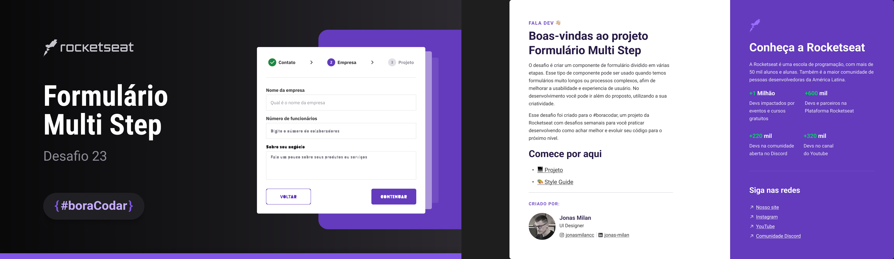

# Animações com Javascript #boraCodar #23

- Animações com Javascript #boraCodar #23 fizemos um formulario multistep com validação de informações usando javascript, css e html, 

> Animações com Javascript #boraCodar #23

#  💻🔧 Deploy 

👉🏼[Link do projeto](https://bora-codar-23-multi-step.vercel.app/)

#  💻🔧 Tecnologias

## Contato 💻

